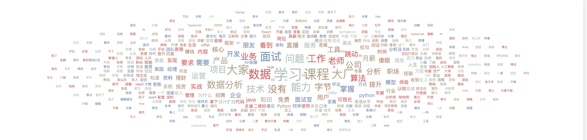

<!-- <p align="center">
</p> -->

<h1 align="center">Liuli</h1>

<p align="center">📖 构建一个多源、干净、个性化的阅读环境</p>
<p align="center"><strong>琉璃开净界，薜荔启禅关</strong></p>

<!-- <div align=center></div> -->

## ✨ 特性

使用`Liuli`，你可以得到（都是Flag）:
- [x] 配置化开发，自定义输入、处理、输出
- [x] 信息备份(支持跨源): Github, MongoDB
- [ ] 机器学习赋能：验证码识别、广告分类、智能标签
- [ ] 阅读源管控，构建知识管理平台
- [x] 官方案例技术支持

使用场景：
- [x] 公众号应用实践：
  - [x] **广告问题**：[打造一个干净且个性化的公众号阅读环境](https://mp.weixin.qq.com/s/NKnTiLixjB9h8fSd7Gq8lw)
  - [ ] **RSS订阅问题**：[基于Liuli构建纯净的RSS公众号信息流]()
- [ ] 信息监控
- [ ] 数据备份

## 🍥 使用

教程[使用前必读]：
 - [01.使用教程](./docs/01.使用教程.md)
 - [02.环境变量](./docs/02.环境变量.md)
 - [03.分发器配置](./docs/03.分发器配置.md)

快速开始，请先确保安装`Docker`：

```shell
mkdir liuli && cd liuli
# 数据库目录
mkdir mongodb_data
# 配置 pro.env 具体查看 doc/02.环境变量.md
vim pro.env
# 下载 docker-compose
wget https://raw.githubusercontent.com/howie6879/liuli/main/docker-compose.yaml
# 启动
docker-compose up -d
```

代码安装使用过程如下：

```shell
# 确保有Python3.7+环境
git clone https://github.com/howie6879/liuli.git
cd liuli

# 创建基础环境
pipenv install --python={your_python3.7+_path}  --skip-lock --dev
# 配置.env 具体查看 doc/02.环境变量.md 启动调度
pipenv run dev_schedule
```

启动成功日志如下：

```shell
Loading .env environment variables...
[2021:12:23 23:08:35] INFO  Liuli Schedule started successfully :)
[2021:12:23 23:08:35] INFO  Liuli Schedule time: 00:00 06:00
[2021:12:23 23:09:36] INFO  Liuli playwright 匹配公众号 老胡的储物柜(howie_locker) 成功! 正在提取最新文章: 我的周刊(第018期)
[2021:12:23 23:09:39] INFO  Liuli 公众号文章持久化成功! 👉 老胡的储物柜
[2021:12:23 23:09:40] INFO  Liuli 🤗 微信公众号文章更新完毕(1/1)
```

推送效果如图：

<div align=center></div>

## 🤔 实现

大概流程如下：

<div align=center></div>

简单解释一下：

- **采集器**：监控各自关注的公众号或者博客源等自定义阅读源，最终构建`Feed`流作为输入源；
- **处理器**：对目标内容进行自定义处理，如基于历史广告数据，利用机器学习实现一个广告分类器（可自定义规则），或者自动打标签等；
- **分发器**：依靠接口层进行数据请求&响应，为使用者提供个性化配置，然后根据配置自动进行分发，将干净的文章流向微信、钉钉、TG甚至自建网站都行。

这样做就实现了干净阅读环境的构建，衍生一下，基于获取的数据，可做的事情有很多，大家不妨发散一下思路。

## 🤖 帮助

为了提升模型的识别准确率，我希望大家能尽力贡献一些广告样本，请看样本文件：[.files/datasets/ads.csv](.files/datasets/ads.csv)，我设定格式如下：

| title        | url          | is_process |
| ------------ | ------------ | ---------- |
| 广告文章标题 | 广告文章连接 | 0          |

字段说明：

- title：文章标题
- url：文章链接，如果微信文章想、请先验证是否失效
- is_process：表示是否进行样本处理，默认填`0`即可

来个实例：

<div align=center></div>

一般广告会重复在多个公众号投放，填写的时候麻烦查一下是否存在此条记录，希望大家能一起合力贡献，亲，来个 [PR](https://github.com/howie6879/liuli/issues/4) 贡献你的力量吧！

## 👀 致谢

感谢以下开源项目：

- [Flask](https://github.com/pallets/flask): web 框架
- [Ruia](https://github.com/howie6879/ruia): 异步爬虫框架
- [playwright](https://playwright.dev/): 使用浏览器进行数据抓取
- [CharCNN](https://github.com/mhjabreel/CharCNN): 感谢`CharCNN`论文作者`Xiang Zhang, Junbo Zhao, Yann LeCun`

您任何PR都是对`Liuli`项目的大力支持，非常感谢以下开发者的贡献（排名不分先后）：

<!-- To get src for img: https://api.github.com/users/username -->
<a href="https://github.com/howie6879"></a>
<a href="https://github.com/AI-xiaofour"></a>
<a href="https://github.com/Xuenew"></a>
<a href="https://github.com/cn-qlg"></a>
<a href="https://github.com/baboon-king"></a>
<a href="https://github.com/123seven"></a>
<a href="https://github.com/zyd16888"></a>
<a href="https://github.com/LeslieLeung"></a>

## 👉 关于

欢迎一起交流（关注入群）：

<div align=center></div>
