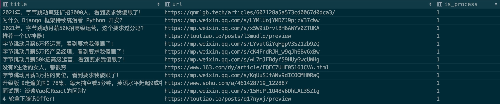

# 2C

> 构建一个多源（公众号、RSS）、干净、个性化的阅读环境

作为一名微信公众号的重度用户，公众号一直被我设为汲取知识的地方。随着使用程度的增加，相信大家或多或少会有一个比较头疼的问题——**广告问题**。

<div align=center></div>

假设你关注的公众号有十来个，若一个公众号两周接一次广告，理论上你会面临二十多次广告，实际上会更多，运气不好的话一天刷下来都是广告也不一定。若你关注了二三十个公众号，那很难避免现阶段公众号环境的广告轰炸。

更可恶的是，大部分的广告，无不是**贩卖焦虑，营造消极气氛**，实在无法忍受且严重影响我的心情。但有些公众号写的文章又确实不错，那怎么做可以不看广告只看文章呢？如果你在公众号阅读体验下深切感受到对于广告的无奈，那么这个项目就是你需要的。

这就是本项目的产生的原因，**构建一个多源（公众号、RSS）、干净、个性化的阅读环境**。

> PS: 这里声明一点，看广告是对作者的支持，这样一定程度上可以促进作者更好地产出。但我看到喜欢的会直接**打赏支持**，所以**搭便车**的言论在我这里站不住脚，谢谢。

## 实现

我的思路很简单，大概流程如下：

<div align=center></div>

简单解释一下：

- **采集器**：监控各自关注的公众号或者博客源，最终构建`Feed`流作为输入源；
- **分类器**（广告）：基于历史广告数据，利用机器学习实现一个广告分类器（可自定义规则），然后给每篇文章自动打上标签再持久化到`MongoDB`；
- **分发器**：依靠接口层进行数据请求&响应，为使用者提供个性化配置，然后根据配置自动进行分发，将干净的文章流向微信、钉钉、TG甚至自建网站都行。

这样做就实现了干净阅读环境的构建，衍生一下，还可以实现个人知识库的构建，可以做诸如标签管理、图谱构建等，这些都可以在接口层进行实现。

实现详情可参考文章[打造一个干净且个性化的公众号阅读环境](https://mp.weixin.qq.com/s/NKnTiLixjB9h8fSd7Gq8lw)。

## 使用

教程[使用前必读]：
 - [01.2C使用教程](./docs/01.2C使用教程.md)
 - [02.2C环境变量](./docs/02.2C环境变量.md)
 - [03.2C分发器配置](./docs/03.2C分发器配置.md)

快速开始，请先确保安装`Docker`：

```shell
mkdir 2c
# 配置 pro.env 具体查看 doc/02.环境变量.md
vim pro.env
# 下载 docker-compose
wget https://raw.githubusercontent.com/howie6879/2c/main/docker-compose.yaml
# 启动
docker-compose up -d
```

代码安装使用过程如下：

```shell
# 确保有Python3.7+环境
git clone https://github.com/howie6879/2c.git
cd 2c

# 创建基础环境
pipenv install --python={your_python3.7+_path}  --skip-lock --dev
# 配置.env 具体查看 doc/02.环境变量.md 启动调度
pipenv run dev_schedule
```

启动成功日志如下：

```shell
Loading .env environment variables...
[2021:12:23 23:08:35] INFO  2C Schedule started successfully :)
[2021:12:23 23:08:35] INFO  2C Schedule time: 00:00 06:00
[2021:12:23 23:09:36] INFO  2C playwright 匹配公众号 老胡的储物柜(howie_locker) 成功! 正在提取最新文章: 我的周刊(第018期)
[2021:12:23 23:09:39] INFO  2C 公众号文章持久化成功! 👉 老胡的储物柜
[2021:12:23 23:09:40] INFO  2C 🤗 微信公众号文章更新完毕(1/1)
```

## 效果

<div align=center></div>

## 帮助

为了提升模型的识别准确率，我希望大家能尽力贡献一些广告样本，请看样本文件：[.files/datasets/ads.csv](.files/datasets/ads.csv)，我设定格式如下：

| title        | url          | is_process |
| ------------ | ------------ | ---------- |
| 广告文章标题 | 广告文章连接 | 0          |

字段说明：

- title：文章标题
- url：文章链接，如果微信文章想、请先验证是否失效
- is_process：表示是否进行样本处理，默认填`0`即可

来个实例：

<div align=center></div>

一般广告会重复在多个公众号投放，填写的时候麻烦查一下是否存在此条记录，希望大家能一起合力贡献，亲，来个 [PR](https://github.com/howie6879/2c/issues/4) 贡献你的力量吧！

## 致谢

感谢以下开源项目：

- [Flask](https://github.com/pallets/flask): web 框架
- [Ruia](https://github.com/howie6879/ruia): 异步爬虫框架
- [docker-playwright-python](https://github.com/danofun/docker-playwright-python): `playwright-python` 的 `Docker` 镜像
- [CharCNN](https://github.com/mhjabreel/CharCNN): 感谢`CharCNN`论文作者`Xiang Zhang, Junbo Zhao, Yann LeCun`
- [CharCnn_Keras](https://github.com/mhjabreel/CharCnn_Keras)

感谢以下开发者的贡献（排名不分先后）：

<!-- To get src for img: https://api.github.com/users/username -->
<a href="https://github.com/howie6879"></a>
<a href="https://github.com/AI-xiaofour"></a>
<a href="https://github.com/Xuenew"></a>
<a href="https://github.com/cn-qlg"></a>
<a href="https://github.com/baboon-king"></a>


## 关于

欢迎与我交流（关注入群）：

<div align=center></div>
